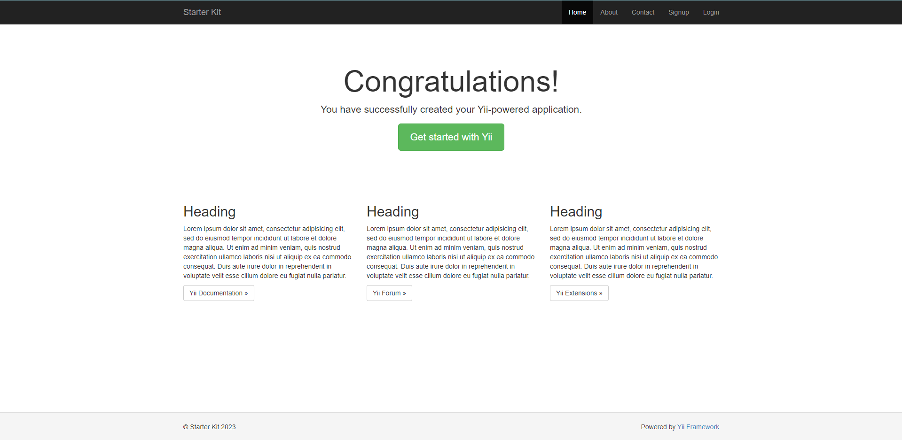

# IMAF Yii2 Starter Kit

git clone https://github.com/Muxtorov98/yii2advanced.git

Go to the project directory

`cd yii2advanced`

`php init`

Run docker containers
`docker compose up -d`

Install composer scripts:

`docker compose exec php composer update`

Migrations

i18n language migrate

`docker compose exec php yii migrate --migrationPath=@yii/i18n/migrations/`

role rbac migrate

`docker compose exec php composer require mdmsoft/yii2-admin "~2.0"`
config
`common -> config -> main-local.php`

`'authManager' => [
'class' => 'yii\rbac\DbManager', // or use 'yii\rbac\DbManager'
]`

`docker compose exec php yii migrate --migrationPath=@yii/rbac/migrations/`

yii migrate

`docker compose exec php yii migrate`

Done! You can open http://localhost:8087/ via browser. By the way, you can change this port by changing

`DOCKER_NGINX_PORT` variable in .env file.

# Docker

For enter to php container run `docker compose exec php bash`

For enter to mysql container run `docker compose exec mysql bash`

For enter to nginx container run `docker compose exec nginx bash`

You can change containers prefix by changing `DOCKER_PROJECT_NAME` variable in .env file.

